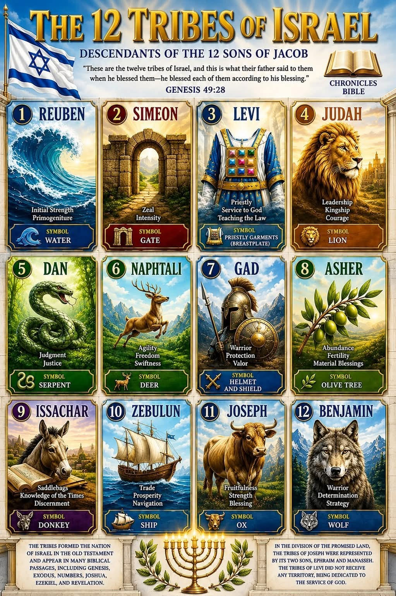
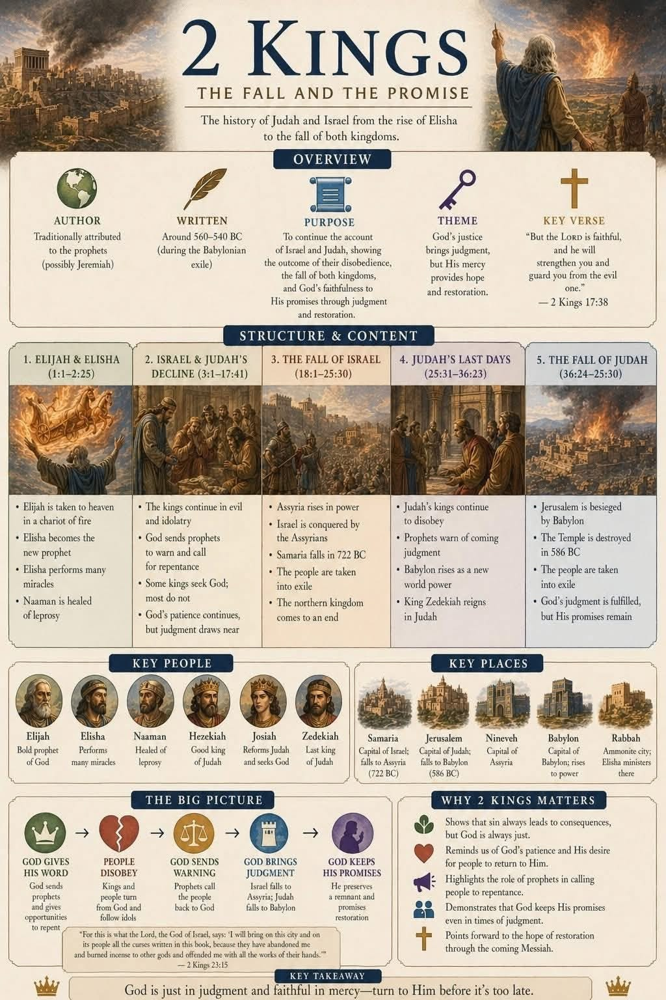

<!-- 
  2 KINGS 16-25 – Sunday School Slides
  Youth Ages 12-16
  
  GENERAL CONFERENCE QUOTES INCLUDED (with speaker, date, source):
  1. Neil L. Andersen – "We Talk of Christ" – Oct 2020
  2. Jeffrey R. Holland – "Waiting on the Lord" – Oct 2020  
  3. Russell M. Nelson – "Drawing the Power of Jesus Christ into Our Lives" – Apr 2017
  4. Russell M. Nelson – "The Book of Mormon: What Would Your Life Be Like without It?" – Oct 2017
  5. Thomas S. Monson – "The Power of the Book of Mormon" – Apr 2017
  6. Massimo de Feo – "Rise! He Calleth Thee" – Apr 2024
  7. Neil L. Andersen – "We Talk of Christ" – Oct 2020
  
  SPEAKER PHOTOS – from spreadsheet at https://docs.google.com/spreadsheets/d/1lw-3HGs5KCoPRjU8uJtXLZgCsxyo0pHPJe0U3eCi-Us/
  - Neil L. Andersen: https://upload.wikimedia.org/wikipedia/commons/8/8e/Neil_L._Andersen_April_2019.jpg
  - Jeffrey R. Holland: https://kutv.com/resources/media/37d2c4b6-60d4-40fe-b275-2998719e974b-JeffreyRHollandofficialportraitJune2018resized.jpg
  - Russell M. Nelson: https://www.churchofjesuschrist.org/imgs/57efa9db7ae0bb889d74594f5a694c413b4483de/full/3840%2C/0/default
  - Thomas S. Monson: https://www.churchofjesuschrist.org/bc/content/shared/content/images/leaders/thomas-s-monson-large.jpg
  - Massimo de Feo: https://news-ie.churchofjesuschrist.org/media/960x1280/Massimo-De-Feo-APy2019.jpg
-->

<!-- SLIDE 1: Title -->
<section data-background-image="https://images.unsplash.com/photo-1506905925346-21bda4d32df4?w=1600" data-background-opacity="0.3" data-background-color="#1a1a2e">
  <h1>2 Kings 16–25</h1>
  <h2 style="color: #e94560;">Faithful Kings • Fallen Kingdom</h2>
  
Ahaz • Hezekiah • Manasseh • Josiah • Babylon

  
👆 Click / tap / use arrow keys to advance • Click highlighted words for more info

</section>

---

<!-- SLIDE 2: Review – 1 & 2 Samuel -->
<section data-background-color="#1a1a2e">
  <h2 style="color:#e94560;">Review: 1 & 2 Samuel</h2>
  

    
    

      <h3 style="color:#ffd700;">From Tribes to a Kingdom</h3>
      <ul style="font-size:0.9em; line-height:1.6;">
        <li><strong>1 Samuel:</strong> Samuel the prophet • Saul anointed as Israel's first king • David defeats Goliath</li>
        <li><strong>2 Samuel:</strong> David becomes king • Jerusalem made capital • God's covenant with David – his throne established forever</li>
      </ul>
      
The 12 Tribes of Israel – descendants of Jacob – united under Saul, then David

    

  

</section>

---

<!-- SLIDE 3: Review – 1 Kings -->
<section data-background-color="#16213e">
  <h2 style="color:#e94560;">Review: 1 Kings</h2>
  

    

      
    

    

      <h3 style="color:#ffd700;">Solomon → Divided Kingdom</h3>
      <ul style="font-size:0.9em; line-height:1.6;">
        <li><strong>Solomon:</strong> wisdom, builds the temple in Jerusalem</li>
        <li><strong>Kingdom divides:</strong> Rehoboam (Judah – south) vs. Jeroboam (Israel – north)</li>
        <li><strong>Elijah:</strong> confronts Ahab & Jezebel, Mt. Carmel – "How long halt ye between two opinions?"</li>
        <li>Northern kingdom (Israel) spirals into idolatry – 19 bad kings in a row, zero righteous</li>
      </ul>
      
1 Kings sets the stage for 2 Kings: two kingdoms drifting from God, prophets calling them back

    

  

</section>

---

<!-- SLIDE 4: 2 Kings Overview -->
<section data-background-color="#0f0f1e">
  <h2 style="color:#e94560; margin-bottom:10px;">2 Kings – The Fall and the Promise</h2>
  
Click image to view full size • Scroll to zoom

  

    
  

  
Author: traditionally Jeremiah • Written ~560–540 BC (Babylonian exile) • Theme: God's justice brings judgment, His mercy brings hope

</section>

---

<!-- SLIDE 5: Ahaz intro with image -->
<section data-background-gradient="linear-gradient(135deg, #2c1a1a, #1a1a2e)">
  

    
    

      <h2 style="color:#e94560;">King Ahaz</h2>
      <h3 style="color:white;">2 Kings 16</h3>
      
Ahaz saw a pagan altar in Damascus and thought it looked cool.

      
📍 Damascus – capital of Aram (modern Syria). Ahaz copied their altar design and had it installed in the Lord's temple in Jerusalem, pushing God's altar aside.

      
He chose the world's trends over God's commandments.

    

  

</section>

---

<!-- SLIDE 6: GC Quote 1 – peer pressure / following the world -->
<section data-background-color="#0f3460">
  

    
    

      
"We care more about being His followers than being 'liked' by our own followers."

      
— Elder Neil L. Andersen "We Talk of Christ" • October 2020 General Conference

      

        
💡 How does this connect to Ahaz?

        
Ahaz wanted to look like the cool kings around him. He copied Damascus because he cared more about fitting in than following God. Don't be an Ahaz – be a Hezekiah.

      

    

  

</section>

---

<!-- SLIDE 7: Kings Timeline Diagrams -->
<section data-background-color="#1a1a2e">
  <h2 style="color:#e94560; margin-bottom:20px;">Kings of Israel & Judah</h2>
  

    

      
      
Kings of Judah

    

    

      
      
Kings timeline

    

    

      
      
The 12 Tribes of Israel – Genesis 49:28

    

  

  
2 Kings 16–25 covers the last kings of Judah: Ahaz → Hezekiah → Manasseh → Josiah → … → Zedekiah (fall of Jerusalem)

</section>

---

<!-- SLIDE 8: Quiz Q1 – Hezekiah -->
<section data-background-gradient="radial-gradient(#1a1a2e, #16213e)">
  <h3 style="color: white;">Q1: Who was king of Judah when Israel fell to Assyria?</h3>
  
2 Kings 18:9-10

  

    
    <ul style="color: white; text-align: left;">
      <li>A: Ahaz</li>
      <li>B: Hezekiah ✅</li>
      <li>C: Josiah</li>
      <li>D: Manasseh</li>
    </ul>
  

  
Hezekiah trusted in the Lord – 2 Kings 18:5

</section>

---

<!-- SLIDE 9: Hezekiah vs Sennacherib – interactive -->
<section data-background-image="https://images.unsplash.com/photo-1509316785289-025f5b846b35?w=1600" data-background-opacity="0.25" data-background-color="#1a1a2e">
  <h2 style="color:#e94560;">Hezekiah vs. Sennacherib</h2>
  
2 Kings 18–19

  

    
🔸 185,000 Assyrian soldiers surrounded Jerusalem

    
🔸 Hezekiah did <strong style="color:#4ade80;">3 things</strong>:

    <ul style="color:#ccc;">
      <li class="fragment" data-fragment-index="3">① Tore his clothes – humbled himself</li>
      <li class="fragment" data-fragment-index="4">② Went to the <strong>temple to pray</strong></li>
      <li class="fragment" data-fragment-index="5">③ Sent for the prophet <strong>Isaiah</strong></li>
    </ul>
    
One angel. One night. 185,000 gone. – 2 Kings 19:35

  

</section>

---

<!-- SLIDE 10: GC Quote 2 – Trusting God (Hezekiah) -->
<section data-background-color="#16213e">
  

    
    

      
"Faith means trusting God in good times and bad, even if that includes some suffering until we see His arm revealed in our behalf."

      
— Elder Jeffrey R. Holland "Waiting on the Lord" • October 2020 General Conference

      

        
💡 Connect to Hezekiah

        
Hezekiah was literally surrounded by an army. He didn't panic – he prayed. God delivered. When you feel surrounded – school, friends, anxiety – do what Hezekiah did.

      

    

  

</section>

---

<!-- SLIDE 11: Quiz Q2 – Ahaz -->
<section data-background-gradient="radial-gradient(#2c1a1a, #1a1a2e)">
  <h3 style="color: white;">Q2: What did King Ahaz do that displeased the Lord?</h3>
  
2 Kings 16:10-14

  <ul style="color: white; text-align:left; max-width:700px; margin:20px auto;">
    <li>A: He rebuilt the temple</li>
    <li>B: He copied a pagan altar from Damascus and placed it in the temple ✅</li>
    <li>C: He gave all his gold to the poor</li>
    <li>D: He freed the captives</li>
  </ul>
  

    
  

</section>

---

<!-- SLIDE 12: Quiz Q3 – Hezekiah prays -->
<section data-background-gradient="radial-gradient(#1a1a2e, #16213e)">
  <h3 style="color: white;">Q3: When Assyria surrounded Jerusalem, what did Hezekiah do?</h3>
  
2 Kings 19:1-14

  <ul style="color: white; text-align:left; max-width:700px; margin:20px auto;">
    <li>A: Surrendered immediately</li>
    <li>B: Fled to Egypt</li>
    <li>C: Prayed to the Lord and sought Isaiah's counsel ✅</li>
    <li>D: Paid them double the tribute</li>
  </ul>
</section>

---

<!-- SLIDE 13: GC Quote 3 – Prayer / drawing power from Christ -->
<section data-background-color="#0f3460">
  

    
    

      
"Reach up to Him in faith."

      
— President Russell M. Nelson "Drawing the Power of Jesus Christ into Our Lives" • April 2017 General Conference

      
Hezekiah literally went up to the temple and spread Sennacherib's threatening letter before the Lord. He reached up. God reached down.

    

  

</section>

---

<!-- SLIDE 14: Quiz Q4 – Angel delivers Jerusalem -->
<section data-background-image="https://images.unsplash.com/photo-1478131143081-828e3c7c5f4c?w=1600" data-background-opacity="0.2" data-background-color="#0a0a1a">
  <h3 style="color: white;">Q4: How was Jerusalem delivered from Sennacherib?</h3>
  
2 Kings 19:35

  <ul style="color: white; text-align:left; max-width:700px; margin:20px auto;">
    <li>A: Hezekiah's army defeated them</li>
    <li>B: An angel of the Lord struck down 185,000 Assyrian soldiers overnight ✅</li>
    <li>C: A plague of locusts</li>
    <li>D: Egypt came to rescue them</li>
  </ul>
</section>

---

<!-- SLIDE 15: Quiz Q5 – Hezekiah's sundial -->
<section data-background-gradient="radial-gradient(#1a1a2e, #2a1a3a)">
  <h3 style="color: white;">Q5: What sign did God give Hezekiah that he would recover?</h3>
  
2 Kings 20:9-11

  

    
    <ul style="color: white; text-align:left;">
      <li>A: A rainbow</li>
      <li>B: The shadow moved backward ten steps on the sundial ✅</li>
      <li>C: A dove landed on his windowsill</li>
      <li>D: It rained for 40 days</li>
    </ul>
  

</section>

---

<!-- SLIDE 16: GC Quote 4 – Scriptures / Josiah finding the Book -->
<section data-background-color="#16213e">
  

    
    

      
"The truths of the Book of Mormon have the power to heal, comfort, restore, succor, strengthen, console, and cheer our souls."

      
— President Russell M. Nelson "The Book of Mormon: What Would Your Life Be Like without It?" • October 2017 General Conference

      

        
📖 Josiah & the Book of the Law

        
Josiah was 26 when they found the lost scriptures in the temple. He tore his clothes in repentance and changed the whole nation. One book found in a dusty corner changed everything. What could daily scripture study do for you?

      

    

  

</section>

---

<!-- SLIDE 17: Quiz Q6 – Manasseh -->
<section data-background-gradient="radial-gradient(#2c1a1a, #1a1a1a)">
  <h3 style="color: white;">Q6: Which king reigned the longest and did much evil?</h3>
  
2 Kings 21:1-9

  <ul style="color: white; text-align:left; max-width:600px; margin:20px auto;">
    <li>A: Josiah</li>
    <li>B: Manasseh ✅</li>
    <li>C: Hezekiah</li>
    <li>D: Zedekiah</li>
  </ul>
  
Longest reign in Judah – and the most wicked. Length ≠ faithfulness.

</section>

---

<!-- SLIDE 18: Quiz Q7 – Josiah finds the Law -->
<section data-background-image="https://images.unsplash.com/photo-1481627834876-b7833e8f5570?w=1600" data-background-opacity="0.2" data-background-color="#1a1a2e">
  <h3 style="color: white;">Q7: What did Josiah do when the Book of the Law was found?</h3>
  
2 Kings 22:11, 23:1-3

  <ul style="color: white; text-align:left; max-width:700px; margin:20px auto;">
    <li>A: Burned it</li>
    <li>B: Hid it again</li>
    <li>C: Tore his clothes in repentance and renewed the covenant ✅</li>
    <li>D: Sold it for silver</li>
  </ul>
</section>

---

<!-- SLIDE 19: GC Quote 5 – Daily scripture study -->
<section data-background-color="#0f3460">
  

    
    

      
"I implore each of us to prayerfully study and ponder the Book of Mormon each day."

      
— President Thomas S. Monson "The Power of the Book of Mormon" • April 2017 General Conference

      
Josiah found one lost book and it changed a nation. What could daily scripture study change in your life?

    

  

</section>

---

<!-- SLIDE 20: Quiz Q8 – Josiah's Passover -->
<section data-background-gradient="radial-gradient(#1a2e1a, #1a1a2e)">
  <h3 style="color: white;">Q8: Josiah's Passover was described as:</h3>
  
2 Kings 23:21-23

  <ul style="color: white; text-align:left; max-width:700px; margin:20px auto;">
    <li>A: Small and quiet</li>
    <li>B: The greatest Passover since the days of the judges ✅</li>
    <li>C: Cancelled due to war</li>
    <li>D: Only for priests</li>
  </ul>
</section>

---

<!-- SLIDE 21: Quiz Q9 – Fall of Judah -->
<section data-background-image="https://images.unsplash.com/photo-1516483638261-f4dbaf036963?w=1600" data-background-opacity="0.2" data-background-color="#2c1810">
  <h3 style="color: white;">Q9: Why did Judah finally fall to Babylon?</h3>
  
2 Kings 24:2-4

  <ul style="color: white; text-align:left; max-width:700px; margin:20px auto;">
    <li>A: They ran out of food</li>
    <li>B: Continued idolatry and rejecting God's prophets ✅</li>
    <li>C: They forgot how to fight</li>
    <li>D: An earthquake destroyed the walls</li>
  </ul>
</section>

---

<!-- SLIDE 22: GC Quote 6 – Repentance / heeding prophets -->
<section data-background-color="#532e1c">
  

    
    

      
"we keep a clear spiritual vision when we leave the natural man behind, repent, and begin a new life in Christ.  The way to do it is by making and keeping covenants to rise to a better life through Jesus Christ."

      
— Elder Massimo de Feo "Rise! He Calleth Thee" • April 2024 General Conference

      

        
⚠️ What Judah got wrong

        
Judah had prophet after prophet warn them – Isaiah, Jeremiah, and more. They ignored them for generations. Don't wait until the walls fall. Repent now.

      

    

  

</section>

---

<!-- SLIDE 23: Quiz Q10 – Gedaliah -->
<section data-background-gradient="radial-gradient(#2c1a1a, #1a1a2e)">
  <h3 style="color: white;">Q10: After Jerusalem fell, who was left to care for the land?</h3>
  
2 Kings 25:12, 22

  <ul style="color: white; text-align:left; max-width:700px; margin:20px auto;">
    <li>A: Nobody – completely empty</li>
    <li>B: The poorest people, under Gedaliah as governor ✅</li>
    <li>C: Only the priests</li>
    <li>D: The Babylonian army</li>
  </ul>
</section>

---

<!-- SLIDE 24: GC Quote 7 – Christ / hope even after failure -->
<section data-background-color="#0f3460">
  

    
    

      
"The Book of Mormon is a powerful witness of Jesus Christ. Virtually every page testifies of the Savior and His divine mission."

      
— Elder Neil L. Andersen "We Talk of Christ" • October 2020 General Conference

      
Even after Jerusalem fell, God didn't abandon His people. Christ is the hope – then and now.

    

  

</section>

---

<!-- SLIDE 25: Discussion -->
<section data-background-color="#0f3460">
  <h2 style="color: white;">Discussion – Click to reveal</h2>
  

    
💬 <strong>1.</strong> Hezekiah prayed when an army was at his gates. When do you feel surrounded, and how can you turn to God?

    
💬 <strong>2.</strong> Josiah was about your age when he started seeking God. What does that tell you?

    
💬 <strong>3.</strong> Ahaz copied what he saw in Damascus because it looked cool. Where do we see pressure to copy the world today?

    
💬 <strong>4.</strong> Judah ignored prophets for generations before falling. How do we listen to God's warnings now?

  

</section>

---

<!-- SLIDE 26: Takeaway -->
<section data-background-color="#e94560" data-background-image="https://images.unsplash.com/photo-1506905925346-21bda4d32df4?w=1600" data-background-opacity="0.15">
  <h1 style="color: white;">Choose to Follow God</h1>
  <h3 style="color: #1a1a2e;">Even when leaders around you don't</h3>
  

    
Ahaz / Manasseh → destruction

    
Hezekiah / Josiah → deliverance

  

  
2 Kings 16–25 • Sunday School • Ages 12–16

  
General Conference quotes: 
  Andersen – "We Talk of Christ" – Oct 2020 
  Holland – "Waiting on the Lord" – Oct 2020 
  Nelson – "Drawing the Power of Jesus Christ into Our Lives" – Apr 2017 
  Nelson – "The Book of Mormon: What Would Your Life Be Like without It?" – Oct 2017 
  Monson – "The Power of the Book of Mormon" – Apr 2017 
  de Feo – "Rise! He Calleth Thee" – Apr 2024

</section>